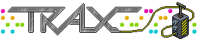
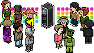

    <!-- base64 flags are available at https://www.phoca.cz/cssflags/ -->
    <!-- Colors: success/brightgreen (current), informational/blue (available), important/orange (incomplete), critical/red (unavailable/to-do) -->
    
    
    

# Traxmachine: Music Creation in Habbo

The Traxmachine, which made its debut in the Finnish hotel in March 2007, has left a permanent mark on the Habbo experience. It introduced the concept of user-generated music, enabling players to create and share their unique tunes. This repository serves as a comprehensive collection of components essential for music creation within the Habbo world, encompassing the Trax Editor, Trax Player, [Samples Archive](/components/samples-archive/README.md), and [Music Archive](/components/musics-archive/README.md).

## Trax: A Brief History

Trax, slang for the plural of track, formed the backbone of Habbo's music system. This encompassed an array of Trax-related products, including Trax Discs, which were purchasable circuit boards containing unique noises. Trax Machines allowed users to play and create music with these discs, although this functionality is currently inactive. CDs served as furniture items for jukeboxes, containing saved songs, and Jukeboxes provided the means to play these CDs.

However, after Habbo's transition from Shockwave to Flash clients, the Trax system lay dormant until April 2011. During this revival, only Jukeboxes, old CDs, and Habbo-sold CDs were re-released. The once-popular Trax system had lost some of its allure, and no new additions had been made, resulting in decreased usage. Custom music creation, which was a staple of Trax in earlier times, became a thing of the past.

## Awesome Links and Related Projects
 
- [Trax Editor - RareWert](https://rarewert.de/trax) - Deploy of the Trax Editor present in this repository
- [Trax Editor - X@JussuC](https://trax-alpha.vercel.app/) - Another awesome Trax Editor remade
- [Habborator | Trax](https://www.habborator.org/trax/) - Quickly preview any of the songs and masterclasses
- [Trax Guide](https://habbohlpcenter.tripod.com/id18.html) - FAQ about Trax
- [Trax | Habbo Wiki | Fandom](https://habbo.fandom.com/wiki/Trax) - Read about the Trax history
- [Habbo Hotel » Trax](https://web.archive.org/web/20070625211706/http://www.habbo.com/hotel/trax/index.html) - Travel through time and see how the Traxmachine was introduced
  - [TraxStore](https://web.archive.org/web/20070625221143/http://www.habbo.com/hotel/trax/store)
  - [The Basics](https://web.archive.org/web/20070625221238/http://www.habbo.com/hotel/trax/masterclass/index.html)
  - [Masterclasses » Hip-Hop](https://web.archive.org/web/20070625211641/http://www.habbo.com/hotel/trax/masterclass/hiphop)
  - [Masterclasses » Rock & Heavy](https://web.archive.org/web/20070625221219/http://www.habbo.com/hotel/trax/masterclass/rock)
  - [Masterclasses » Electronic](https://web.archive.org/web/20070828021851/http://www.habbo.com/hotel/trax/masterclass/electronic)
  - [Masterclasses » Disco](https://web.archive.org/web/20070822231127/http://www.habbo.com:80/hotel/trax/masterclass/disco)
  - [Masterclasses » 8-bit](https://web.archive.org/web/20070827210745/http://www.habbo.com/hotel/trax/masterclass/habbo)
  - [Masterclasses » Latin & Reggae](https://web.archive.org/web/20070828021613/http://www.habbo.com/hotel/trax/masterclass/groove)
  - [Masterclasses » SFX](https://web.archive.org/web/20070822232853/http://www.habbo.com/hotel/trax/masterclass/sfx)
  - [Masterclasses » Ambient](https://web.archive.org/web/20070827125040/http://www.habbo.com/hotel/trax/masterclass/ambient)
  - [FAQ](https://web.archive.org/web/20070626001213/http://www.habbo.com/help/faqs?faq_1_categoryId=56)
- [Webbanditten/TraxPlayer](https://github.com/Webbanditten/TraxPlayer) - Recreation of the Trax Player originally a Flash(.swf) embedded element
- [dank074/music-player](https://github.com/dank074/music-player/) - Plays habbo trax music
- [Traxmachine | Mangetoica](http://mangetoica.com/trax/) - Recreation of the Trax Editor

# GNU GPLv3 License

This project is licensed under the GNU General Public License v3.0 - see the [LICENSE](./LICENSE.md) file for details.