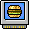

On this page:

[[_TOC_]]

---

The samples are divided by sound sets, with 9 samples each. Each sample in one sound set has an symbol associated:

The amount of spaces that the sample use in the timeline is not associated to its symbol, so change for each sound set.

## Sound sets list

### Names

<code>com</code>, <code>com.br</code> and <code>com.tr</code>

Source: [`com`](uploads/names/names_com.json), [`com.br`](uploads/names/names_com.br.json) and [`com.tr`](uploads/names/names_com.tr.json)

| # | `com` | `com.br` | `com.tr` |
|-|-|-|-|
| 1 | Habbo Sounds 1 | Duck Funk - DJ Fuse | Habbo Sesleri 1 |
| 2 | Habbo Sounds 3 | Habbo - DJ Fuse | Habbo Sesleri 3 |
| 3 | Electronic 1 | BattleBall | Elektronik 1 |
| 4 | Ambient 1 | Aventuras dos Pôr do Sol | Ortam 1 |
| 5 | Ambient 4 | Céu Nublado | Ortam 4 |
| 6 | Ambient 3 | Ambiências | Ortam 3 |
| 7 | SFX 5 | Som dos Mobis | Ses Efektleri 5 |
| 8 | Ambient 2 | Electrônico | Ortam 2 |
| 9 | Electronic 2 | Místico | Elektronik 2 |
| 10 | Hip Hop Beats 1 | Boy Band | Hip Hop Şarkıları 1 |
| 11 | Dance 4 | Spicey Donna | Dans 4 |
| 12 | Habbo Sounds 2 | Abe Normal | Habbo Sesleri 2 |
| 13 | Dance 5 | Café Muzzakh | Dans 5 |
| 14 | Hip hop Beats 2 | Ex da Cameron | Hip Hop Şarkıları 2 |
| 15 | RnB Grooves 6 | El Generico | RnB Şarkıları 6 |
| 16 | Hip hop Beats 3 | Ferry Nultado | Hip Hop Şarkıları 3 |
| 17 |  | Jive Sideburns | Uzun Favorili Jive |
| 18 | Little Tanga Beach | Cartucho Samba | Küçük Tanga Sahili |
| 19 | MnM | MnM | MnM |
| 20 | Monkey Paradise | Monkey Paradise | Maymun Cenneti |
| 21 | Snotty Day | Snotty Day | Zor Gün |
| 22 | A Day In Park | A Day In Park | Parkta Bir Gün |
| 23 | Nature Nightlife | Nature Nightlife | Doğanın Gece Hayatı |
| 24 | Compu FX | Compu | Bilgisayar Efektleri |
| 25 | Party Pack | Party Pack | Parti Paketi |
| 26 | Bhangra Mangra | Bhangra Mangra | Bhangra Mangra |
| 27 | Rasta.Claus's Pack | Rasta Santa Mix | Rasta.Claus'un Ekibi |
| 28 | Moshy Metal | Metal | Moshy Metal |
| 29 | Dance 2 | Festa no Apê | Dans 2 |
| 30 | Instrumental 1 | Cartucho Melódico | Enstrümental 1 |
| 31 | Dance 3 | DJ Balada | Dans 3 |
| 32 | Instrumental 2 | Pianinho | Enstrümental 2 |
| 33 | Rock 3 | Yngvie Van Halen | Rock 3 |
| 34 | Rock 5 | Rockin' riffs | Rock 5 |
| 35 | Dance 6 | Festa Funk | Dans 6 |
| 36 | Bossa Nueva | Bom Balanço | Bossa Nueva |
| 37 | Sound set 37 | Música de Cinema | Ses seti 37 |
| 38 | Rock 6 | Highway to Habbo | Rock 6 |
| 39 | Rock 7 | Iron Maid | Rock 7 |
| 40 | Rock 4 | Pixels On The Water | Rock 4 |
| 41 | Rock 8 | Sympathy for the coder | Rock 8 |
| 42 | Sound set 42 | Snouthill Horror | Ses seti 42 |
| 43 | SFX 1 | Silence of the Moderators | Ses Efektleri 1 |
| 44 | Sound set 44 | Ghost Story | Ses seti 44 |
| 45 | Berlin Connection | Conexão Berlim | Berlin Connection |
| 46 | Club 1 | Sound set 46 | Kulüp 1 |
| 47 | Club 2 | Sound set 47 | Kulüp 2 |
| 48 | Club 3 | Sound set 48 | Kulüp 3 |
| 49 | Club 4 | Sound set 49 | Kulüp 4 |
| 50 | Club 5 | Sound set 50 | Kulüp 5 |
| 51 | Club 6 | Sound set 51 | Kulüp 6 |
| 52 | Club 7 | Trancehouse | Kulüp 7 |
| 53 | Oh Holy Habbo | Habbo Sagrado | Ooo Kutsal Habbo |
| 54 | Rudolph's Loops | Loops da Rena | Rudolph'un Döngüleri |
| 55 | RnB Grooves 1 | Sound set 55 | RnB Şarkıları 1 |
| 56 | RnB Grooves 2 | Sound set 56 | RnB Şarkıları 2 |
| 57 | RnB Grooves 3 | Sound set 57 | RnB Şarkıları 3 |
| 58 | RnB Grooves 4 | Sound set 58 | RnB Şarkıları 4 |
| 59 | RnB Grooves 5 | Sound set 59 | RnB Şarkıları 5 |
| 60 | Latin 1 | Cartucho Amor Latino | Latin 1 |
| 61 | Latin 2 | Cartucho Habborella | Latin 2 |
| 62 | Trax Alhambra 1 | O som do Gênio | Alhambra Şarkıları 1 |
| 63 | Trax Alhambra 2 | 1001 Noites | Alhambra Şarkıları 2 |
| 64 | Trax Alhambra 3 | Batidas Marroquinas | Alhambra Şarkıları 3 |
| 65 | Tiki Trax Pack 1 | Sound set 65 | Tiki Şarkı Paketi 1 |
| 66 | Tiki Trax Pack 2 | Sound set 66 | Tiki Şarkı Paketi 2 |
| 67 | Tiki Trax Pack 3 | Sound set 67 | Tiki Şarkı Paketi 3 |
| 68 | Madball Trax 1 | Sound set 68 | Madball Şarkıları 1 |
| 69 | Madball Trax 2 | Sound set 69 | Madball Şarkıları 2 |
| 70 | Madball Trax 3 | Sound set 70 | Madball Şarkıları 3 |
| 71 | Sound set 71 | Cartucho Natal 2008 | Ses seti 71 |
| 72 | Country Trax Pack | Sons da roça | Halk Müziği Şarkı Paketi |

<code>de</code>, <code>es</code> and <code>fi</code>

Source: [`de`](uploads/names/names_de.json), [`es`](uploads/names/names_es.json) and [`fi`](uploads/names/names_fi.json)

| # | `de` | `es` | `fi` |
|-|-|-|-|
| 1 | Duck Funk von DJFuse | Habbo Sounds 1 | Habbo Sounds 1 |
| 2 | Habbo Theme by DJFuse | Habbo Sounds 3 | Habbo Sounds 3 |
| 3 | Battle Ball Sound | Electronic 1 | Electronic 1 |
| 4 | Café del Habbo | Ambient 1 | Ambient 1 |
| 5 | Dunkle Beats | Ambient 4 | Ambient 4 |
| 6 | Passend fürs Ambiente | Ambient 3 | Ambient 3 |
| 7 | Furni Sounds 1 | SFX 5 | SFX 5 |
| 8 | Elektro-Sound | Ambient 2 | Ambient 2 |
| 9 | Mystische Magie | Electronic 2 | Electronic 2 |
| 10 | Boy Band Sensation | Hip Hop Beats 1 | Hip Hop Beats 1 |
| 11 | Spicey Donna | Dance 4 | Dance 4 |
| 12 | Abe Normal | Habbo Sounds 2 | Habbo Sounds 2 |
| 13 | Cafe Muzzakh | Dance 5 | Dance 5 |
| 14 | Cameron's Ex | Hip Hop Beats 2 | Hip Hop Beats 2 |
| 15 | El Generico | RnB Grooves 6 | RnB Grooves 6 |
| 16 | Ferry Nultado | Hip Hop Beats 3 | Hip Hop Beats 3 |
| 17 | Jive Sideburns | Groove 3 | Groove 3 |
| 18 | Little Tanga Beach | Groove 4 | Groove 4 |
| 19 | MnM | Hip Hop Beats 4 | Hip Hop Beats 4 |
| 20 | Monkey Paradise | SFX 2 | SFX 2 |
| 21 | Snotty Day | Rock 1 | Rock 1 |
| 22 | A Day In Park | SFX 3 | SFX 3 |
| 23 | Nature Nightlife | SFX 4 | SFX 4 |
| 24 | Compu FX | Habbo Sounds 4 | Habbo Sounds 4 |
| 25 | Party Pack | Dance 1 | Dance 1 |
| 26 | Bhangra Mangra | Groove 1 | Groove 1 |
| 27 | Rasta Santa's Pack | Groove 2 | Groove 2 |
| 28 | Moshy Metal | Rock 2 | Rock 2 |
| 29 | Dancefloor burners | Dance 2 | Dance 2 |
| 30 | Double Peaks | Instrumental 1 | Instrumental 1 |
| 31 | Clubber's delight | Dance 3 | Dance 3 |
| 32 | Pianissimo | Instrumental 2 | Instrumental 2 |
| 33 | Yngvie Van Halen | Rock 3 | Rock 3 |
| 34 | Rockin' riffs | Rock 5 | Rock 5 |
| 35 | Supa Funk | Dance 6 | Dance 6 |
| 36 | Bossa Nueva | Latin 3 | Latin 1 |
| 37 | Habbowood | Habbowood | Habbowood |
| 38 | Highway To Habbo | Rock 6 | Rock 6 |
| 39 | Pixels On The Water | Rock 7 | Rock 7 |
| 40 | Iron Maid | Rock 4 | Rock 4 |
| 41 | Sympathy For The Coder | Rock 8 | Rock 8 |
| 42 | Snouthill Horror | Snouthill Horror | Snouthill Horror |
| 43 | Silence of The Mods | SFX 1 | SFX 1 |
| 44 | Ghost Story | Ghost Story | Ghost Story |
| 45 | SantasTechnohits 1 | Techno 1 | Berlin Connection |
| 46 | Club Sounds III | Club 1 | Club 1 |
| 47 | Loco electro | Club 2 | Club 2 |
| 48 | Jackin' Chicago | Club 3 | Club 3 |
| 49 | Maximum Minimal | Club 4 | Club 4 |
| 50 | Nu Skool Breakz | Club 5 | Club 5 |
| 51 | NYC Beat | Club 6 | Club 6 |
| 52 | SantasTechnohits 2 | Club 7 | Club 7 |
| 53 | Xmas-Hits 1 | Far West 2 | Oh holy Habbo |
| 54 | Xmas-Hits 2 | Sound set 54 | Rudolph's Loops |
| 55 | RnB Grooves 1 | R&B Grooves 1 | RnB Grooves 1 |
| 56 | RnB Grooves 2 | R&B Grooves 2 | RnB Grooves 2 |
| 57 | RnB Grooves 3 | R&B Grooves 3 | RnB Grooves 3 |
| 58 | RnB Grooves 4 | R&B Grooves 4 | RnB Grooves 4 |
| 59 | RnB Grooves 5 | Sound set 59 | RnB Grooves 5 |
| 60 | Latin 1 | Latin 1 | Latin 3 |
| 61 | Latin 2 | Latin 2 | Latin 2 |
| 62 | Sound set 62 | Alhambra 1 | Alhambra 1 |
| 63 | Sound set 63 | Alhambra 2 | Alhambra 2 |
| 64 | Sound set 64 | Alhambra 3 | Alhambra 3 |
| 65 | Tiki Sounds 1 | Tiki Sound 1 | Tiki 1 |
| 66 | Tiki Sounds 2 | Tiki Sound 2 | Tiki 2 |
| 67 | Tiki Sounds 3 | Tiki Sound 3 | Tiki 3 |
| 68 | EM Sounds 1 | Sport 1 | Madball 1 |
| 69 | EM Sounds 2 | Sport 2 | Madball 2 |
| 70 | EM Sounds 3 | Sport 3 | Madball 3 |
| 71 | Arctic Trax | Ártico | Arctic sounds |
| 72 | Country Tracks | Campo | Kantri |

<code>fr</code>, <code>it</code> and <code>nl</code>

Source: [`fr`](uploads/names/names_fr.json), [`it`](uploads/names/names_it.json) and [`nl`](uploads/names/names_nl.json)

| # | `fr` | `it` | `nl` |
|-|-|-|-|
| 1 | Dunk funk | DJ Fuse's Duck Funk | DJ Fuse's Duck Funk |
| 2 | Break dance | DJ Fuse's Habbo Theme | DJ Fuse's Habbo Theme |
| 3 | Battle Bell | BattleBall Theme | BattleBall thema's |
| 4 | Cool ambiance | Sunset Adventures | Zonnige en warm |
| 5 | Musique d'horreur | Dark Skies | Dark Skies |
| 6 | Ambiance nature | Ambience | Ambient soundset |
| 7 | Mobi musique | Furni Sounds Vol. 1 | Meubi Sounds 1 |
| 8 | HabboElectro | Electronica | Electronica |
| 9 | Voix mystiques | Mysto Magica | Mysto Magica |
| 10 | Boys Band Style | Boy Band Sensation | Boyband Sensation |
| 11 | Spicey Donna | Spicey Donna | Spicey Donna |
| 12 | Abe Normal | Abe Normal | Underground beats |
| 13 | Cafe Muzzakh | Cafe Muzzakh | Cafe Muzzakh |
| 14 | Cameron's Ex | Cameron's Ex | Just in swing |
| 15 | El Generico | El Generico | El Generico |
| 16 | Ferry Nultado | Ferry Nultado | Woooh DJ |
| 17 | Jive Sideburns | Jive Sideburns | Funky Sideburns |
| 18 | Little Tanga Beach | Little Tanga Beach | Samba Beach |
| 19 | MnM | MnM | Jetset |
| 20 | Monkey Paradise | Monkey Paradise | Apen Paradise |
| 21 | Snotty Day | Snotty Day | Baaldag |
| 22 | A Day In Park | A Day In Park | Dag in het park |
| 23 | Nature Nightlife | Nature Nightlife | Nature Nightlife |
| 24 | Compu FX | Compu FX | Compu FX |
| 25 | Party Pack | Party Pack | Partypakket |
| 26 | Bhangra Mangra | Bhangra Mangra | Bhangra Mangra |
| 27 | Rasta Santa's Pack | Rasta Santa's Pack | Dubstyle Rasta |
| 28 | Moshy Metal | Moshy Metal | Zware metalen |
| 29 | Dancefloor burners | Dancefloor Burners | Voor de dansvloer |
| 30 | Double Peaks | Double Peaks | Hoogtepunten |
| 31 | Clubber's delight | Clubber's Delight | Clubber's delight |
| 32 | Pianissimo | Pianissimo | Pianissimo |
| 33 | Yngvie Van Halen | Yngvie Van Halen | 100% gitaar |
| 34 | Rockin' riffs | Rockin' riffs | Rockin' riffs |
| 35 | Supa Funk | Supa Funk | Supa Funk |
| 36 | Bossa Nueva | Bossa Nueva | Bossa Nueva |
| 37 | B.O. Habbowood | Sound set 37 | Habbowood |
| 38 | Highway to Habbo | Highway to Habbo | Highway to Habbo |
| 39 | Pixel on the water | Iron Maid | Mods on the Water |
| 40 | Iron Maid | Pixels on the Water | Iron Habbo |
| 41 | Sympathy for the Coder | Sympathy For The Coder | Sympathy For The Pixel |
| 42 | Snouthill Horror | Snouthill Horror | Habbo Horror |
| 43 | Silence of the flooders | Silence Of The Moderators | Eng gekraak |
| 44 | Ghost story | Ghost Story | Spookgeluiden |
| 45 | Berlin Connection | Berlin Connection | Berlin Connection |
| 46 | Club Sounds III | Sound set 46 | Club Sounds III |
| 47 | Loco Electro | Sound set 47 | Loco electro |
| 48 | Jackin' Chicago | Sound set 48 | Jackin' Chicago |
| 49 | Maximum Minimal | Sound set 49 | Maximum Minimal |
| 50 | Nu Skool Breakz | Sound set 50 | Nu Skool Breakz |
| 51 | NYC Beat | Sound set 51 | NYC Beat |
| 52 | State of Trancehouse | State of Trancehouse | State of Trance |
| 53 | Oh Holly Habbo | Oh holy Habbo | Jingle beats |
| 54 | Rudolph's loop | Rudolph's Loops | Swingende kerst |
| 55 | RnB Grooves 1 | Sound set 55 | Pixel Party Vol. 1 |
| 56 | RnB Grooves 2 | Sound set 56 | Pixel Party Vol. 2 |
| 57 | RnB Grooves 3 | Sound set 57 | Pixel Party Vol. 3 |
| 58 | RnB Grooves 4 | RnB Grooves 4 | Pixel Party Vol. 4 |
| 59 | RnB Grooves 5 | RnB Grooves 5 | Pixel Party Vol. 5 |
| 60 | Latino 1 | Latin 1 | Habbo Latino Vol. 1 |
| 61 | Latino 2 | Latin 2 | Habbo Latino Vol. 2 |
| 62 | Skeud Alhambra 1 | Alhambra 1 | Sultan Sounds |
| 63 | Skeud Alhambra 2 | Alhambra 2 | Desert Beats |
| 64 | Skeud Alhambra 3 | Alhambra 3 | Camel Club |
| 65 | Tiki 1 | Tiki 1 | Tiki Sounds Vol.1 |
| 66 | Tiki 3 | Tiki 2 | Tiki Sounds Vol.2 |
| 67 | Tiki 3 | Tiki 3 | Tiki Sounds Vol.3 |
| 68 | Sound set 68 | Sound set 68 | Supporters Sounds |
| 69 | Sound set 69 | Sound set 69 | Aanvalluh! |
| 70 | Sound set 70 | Sound set 70 | Habbo Volkslied |
| 71 | Trax Pingouin | Sound set 71 | Arctic Trax |
| 72 | Ambiance picnic | Country | Agro Country Hits |

### Images and Details

> Click on the images to go to the corresponding page with more details.

| | | | | | | | | |
|:-:|:-:|:-:|:-:|:-:|:-:|:-:|:-:|:-:|
| 1   |2   |3   |4   |5   |6   |7   |8   |9   |
| 10   |11   |12   |13   |14   |15   |16   |17   |18   |
| 19   |20   |21   |22   |23   |24   |25   |26   |27   |
| 28   |29   |30   |31   |32   |33   |34   |35   |36   |
| 37   |38   |39   |40   |41   |42   |43   |44   |45   |
| 46   |47   |48   |49   |50   |51   |52   |53   |54   |
| 55   |56   |57   |58   |59   |60   |61   |62   |63   |
| 64   |65   |66   |67   |68   |69   |70   |71   |72   |
