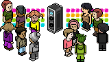

    <!-- base64 flags are available at https://www.phoca.cz/cssflags/ -->
    <!-- Colors: success/brightgreen (current), informational/blue (available), important/orange (incomplete), critical/red (unavailable/to-do) -->
    
    
    

# Traxmachine: Musik erstellen im Habbo

Die Traxmachine, die im März 2007 im finnischen Hotel debütierte, hat einen bleibenden Eindruck auf die Habbo-Erfahrung hinterlassen. Sie führte das Konzept der benutzererzeugten Musik ein und ermöglichte es den Spielern, ihre eigenen einzigartigen Melodien zu erstellen und zu teilen. Dieses Repository dient als umfassende Sammlung von Komponenten, die für die Musikproduktion in der Habbo-Welt unerlässlich sind, darunter der Trax Editor, Trax Player, [Samples-Archiv](/components/samples-archive/README.md) und [Musik-Archiv](/components/musics-archive/README.md).

## Trax: Eine kurze Geschichte

Trax, Slang für die Mehrzahl von Track, bildete das Rückgrat des Musiksystems von Habbo. Dies umfasste eine Reihe von Trax-bezogenen Produkten, einschließlich Trax Discs, die kaufbare Leiterplatten mit einzigartigen Geräuschen waren. Trax-Maschinen ermöglichten es den Benutzern, Musik mit diesen Discs abzuspielen und zu erstellen, obwohl diese Funktion derzeit inaktiv ist. CDs dienten als Möbelstücke für Jukeboxes und enthielten gespeicherte Lieder, während Jukeboxes die Möglichkeit boten, diese CDs abzuspielen.

Nach Habbos Übergang von Shockwave zu Flash-Clients lag das Trax-System jedoch bis April 2011 brach. Während dieses Revivals wurden nur Jukeboxes, alte CDs und von Habbo verkaufte CDs erneut veröffentlicht. Das einst beliebte Trax-System hatte einen Teil seines Reizes verloren, und es wurden keine neuen Ergänzungen vorgenommen, was zu einer geringeren Nutzung führte. Die benutzerdefinierte Musikproduktion, die in früheren Zeiten ein fester Bestandteil von Trax war, wurde zur Vergangenheit.

## Tolle Links und verwandte Projekte

- [Trax Editor - RareWert](https://rarewert.de/trax) - Bereitstellung des Trax Editors aus diesem Repository
- [Trax Editor - X@JussuC](https://trax-alpha.vercel.app/) - Ein weiterer beeindruckender, neu erstellter Trax Editor
- [Habborator | Trax](https://www.habborator.org/trax/) - Schnelle Vorschau aller Songs und Meisterklassen
- [Trax Guide](https://habbohlpcenter.tripod.com/id18.html) - Häufig gestellte Fragen zu Trax
- [Trax | Habbo Wiki | Fandom](https://habbo.fandom.com/wiki/Trax) - Erfahren Sie mehr über die Geschichte von Trax
- [Habbo Hotel » Trax](https://web.archive.org/web/20070625211706/http://www.habbo.com/hotel/trax/index.html) - Reisen Sie durch die Zeit und sehen Sie, wie die Traxmachine eingeführt wurde
  - [TraxStore](https://web.archive.org/web/20070625221143/http://www.habbo.com/hotel/trax/store)
  - [Die Grundlagen](https://web.archive.org/web/20070625221238/http://www.habbo.com/hotel/trax/masterclass/index.html)
  - [Meisterklassen » Hip-Hop](https://web.archive.org/web/20070625211641/http://www.habbo.com/hotel/trax/masterclass/hiphop)
  - [Meisterklassen » Rock & Heavy](https://web.archive.org/web/20070625221219/http://www.habbo.com/hotel/trax/masterclass/rock)
  - [Meisterklassen » Elektronisch](https://web.archive.org/web/20070828021851/http://www.habbo.com/hotel/trax/masterclass/electronic)
  - [Meisterklassen » Disco](https://web.archive.org/web/20070822231127/http://www.habbo.com:80/hotel/trax/masterclass/disco)
  - [Meisterklassen » 8-Bit](https://web.archive.org/web/20070827210745/http://www.habbo.com/hotel/trax/masterclass/habbo)
  - [Meisterklassen » Latin & Reggae](https://web.archive.org/web/20070828021613/http://www.habbo.com/hotel/trax/masterclass/groove)
  - [Meisterklassen » SFX](https://web.archive.org/web/20070822232853/http://www.habbo.com/hotel/trax/masterclass/sfx)
  - [Meisterklassen » Ambient](https://web.archive.org/web/20070827125040/http://www.habbo.com/hotel/trax/masterclass/ambient)
  - [FAQ](https://web.archive.org/web/20070626001213/http://www.habbo.com/help/faqs?faq_1_categoryId=56)
- [Webbanditten/TraxPlayer](https://github.com/Webbanditten/TraxPlayer) - Neu erstellte Version des ursprünglichen Trax Players, der ursprünglich ein Flash (.swf) eingebettetes Element war
- [dank074/music-player](https://github.com/dank074/music-player/) - Spielt Habbo Trax-Musik ab
- [Traxmachine | Mangetoica](http://mangetoica.com/trax/) - Neu erstellte Version des Trax Editors

# GNU GPLv3 Lizenz

Dieses Projekt ist unter der GNU General Public License Version 3.0 lizenziert - siehe die [Lizenz](../LICENSE.md)-Datei für Details.
