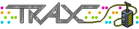

    <!-- base64 flags are available at https://www.phoca.cz/cssflags/ -->
    <!-- Colors: success/brightgreen (current), informational/blue (available), important/orange (incomplete), critical/red (unavailable/to-do) -->
    
    
    

# Traxmachine: Criação Musical no Habbo

A Traxmachine, que fez sua estreia no hotel finlandês em março de 2007, deixou uma marca permanente na experiência do Habbo. Ela introduziu o conceito de música gerada pelo usuário, permitindo que os jogadores criem e compartilhem suas músicas exclusivas. Este repositório serve como uma coleção abrangente de componentes essenciais para a criação de música no mundo Habbo, incluindo o Editor Trax, Reprodutor Trax, Arquivo de Sons e Arquivo de Músicas.

## Trax: Uma Breve História

Trax, gíria para o plural de faixa (track), formou a espinha dorsal do sistema de música do Habbo. Isso abrangeu uma variedade de produtos relacionados ao Trax, incluindo Trax Discs, que eram placas de circuito disponíveis para compra contendo sons únicos. As Trax Machines permitiam que os usuários reproduzissem e criassem música com esses discos, embora essa funcionalidade esteja atualmente inativa. CDs serviam como itens de mobília para jukeboxes, contendo músicas salvas, e as Jukeboxes forneciam os meios para reproduzir esses CDs.

No entanto, após a transição do Habbo dos clientes Shockwave para Flash, o sistema Trax permaneceu inativo até abril de 2011. Durante esse renascimento, apenas Jukeboxes, CDs antigos e CDs vendidos pelo Habbo foram relançados. O sistema Trax, antes popular, havia perdido parte de seu apelo, e nenhuma adição nova havia sido feita, resultando em uma diminuição no uso. A criação de músicas personalizadas, que era uma característica do Trax em tempos anteriores, se tornou coisa do passado.

## Links Incríveis e Projetos Relacionados

- [Trax Editor - RareWert](https://rarewert.de/trax) - Implantação do Trax Editor presente neste repositório
- [Trax Editor - X@JussuC](https://trax-alpha.vercel.app/) - Outro incrível Trax Editor refeito
- [Habborator | Trax](https://www.habborator.org/trax/) - Visualize rapidamente qualquer uma das músicas e masterclasses
- [Guia Trax](https://habbohlpcenter.tripod.com/id18.html) - FAQ sobre Trax
- [Trax | Habbo Wiki | Fandom](https://habbo.fandom.com/wiki/Trax) - Leia sobre a história do Trax
- [Habbo Hotel » Trax](https://web.archive.org/web/20070625211706/http://www.habbo.com/hotel/trax/index.html) - Viaje no tempo e veja como a Traxmachine foi introduzida
  - [TraxStore](https://web.archive.org/web/20070625221143/http://www.habbo.com/hotel/trax/store)
  - [O Básico](https://web.archive.org/web/20070625221238/http://www.habbo.com/hotel/trax/masterclass/index.html)
  - [Masterclasses » Hip-Hop](https://web.archive.org/web/20070625211641/http://www.habbo.com/hotel/trax/masterclass/hiphop)
  - [Masterclasses » Rock & Heavy](https://web.archive.org/web/20070625221219/http://www.habbo.com/hotel/trax/masterclass/rock)
  - [Masterclasses » Eletrônica](https://web.archive.org/web/20070828021851/http://www.habbo.com/hotel/trax/masterclass/electronic)
  - [Masterclasses » Disco](https://web.archive.org/web/20070822231127/http://www.habbo.com:80/hotel/trax/masterclass/disco)
  - [Masterclasses » 8-bit](https://web.archive.org/web/20070827210745/http://www.habbo.com/hotel/trax/masterclass/habbo)
  - [Masterclasses » Latin & Reggae](https://web.archive.org/web/20070828021613/http://www.habbo.com/hotel/trax/masterclass/groove)
  - [Masterclasses » SFX](https://web.archive.org/web/20070822232853/http://www.habbo.com/hotel/trax/masterclass/sfx)
  - [Masterclasses » Ambiente](https://web.archive.org/web/20070827125040/http://www.habbo.com/hotel/trax/masterclass/ambient)
  - [FAQ](https://web.archive.org/web/20070626001213/http://www.habbo.com/help/faqs?faq_1_categoryId=56)
- [Webbanditten/TraxPlayer](https://github.com/Webbanditten/TraxPlayer) - Recriação do Trax Player originalmente um elemento incorporado em Flash (.swf)
- [dank074/music-player](https://github.com/dank074/music-player/) - Toca músicas do Habbo Trax
- [Traxmachine | Mangetoica](http://mangetoica.com/trax/) - Recriação do Trax Editor

# Licença GNU GPLv3

Este projeto está licenciado sob a Licença Pública Geral GNU versão 3.0 - consulte o arquivo [LICENSE](../LICENSE.md) para obter detalhes.